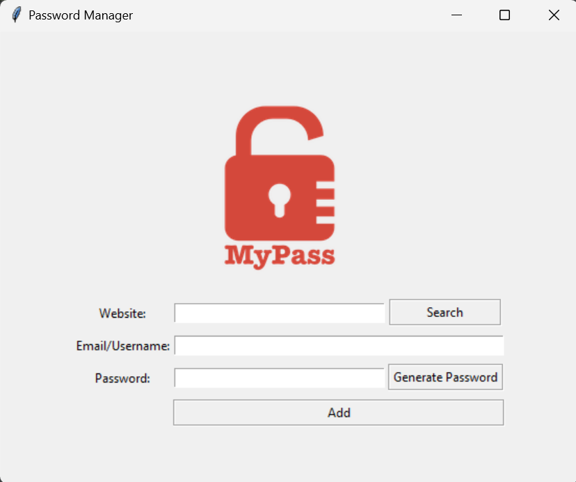

# GUI based password generator and manager using pyhton and tkinter
# This project is created using python 3.12, pycharm IDE, tkinter

**Steps to run the project**
1. Install python 3.12
2. Open project in the python IDE
3. Install module pyperclip
   

# Usage Guide

## Saving a password
- Enter the website name.
- Enter the E-mail/Username
- Enter password or click on generate password
- Click Add
- Confirm details
- Password will saved and copied to the clipboard

## Searching a saved password
- Enter the website name and click search
- If the search is successful, the password will be copied to the clipboard

# Created by AQIB ALI

